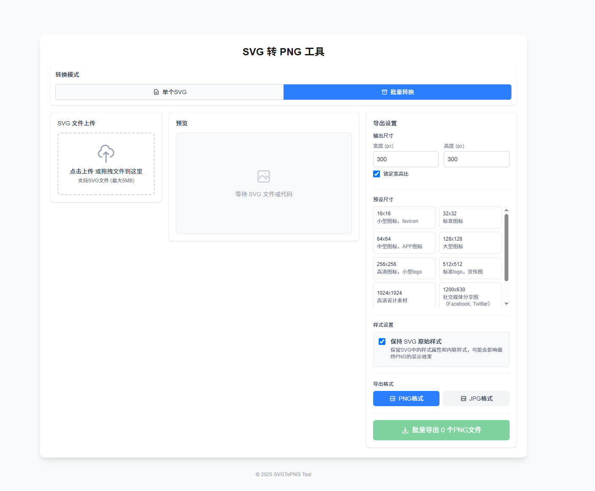

# SVG 转 PNG 工具

这是一个基于 Next.js 的 SVG 转 PNG 转换工具，提供以下功能：

- 单个 SVG 文件转换
- 批量 SVG 文件转换
- 自定义输出尺寸（支持锁定宽高比）
- 多种预设尺寸选择
- 实时预览转换效果
- 保留原始样式选项

## 功能特性

- **两种模式**：支持单个文件转换和批量转换模式
- **尺寸调整**：可自定义输出 PNG 的宽度和高度
- **宽高比锁定**：保持原始 SVG 的宽高比例
- **预设尺寸**：提供常用尺寸预设（16x16, 32x32, 64x64 等）
- **实时预览**：转换前可预览 SVG 效果
- **样式保留**：可选择是否保留 SVG 原始样式

## 界面预览图



## 快速开始

首先，安装依赖并启动开发服务器：

```bash
npm install
npm run dev
# or
yarn dev
# or
pnpm dev
# or
bun dev
```

使用您的浏览器打开 [http://localhost:3000](http://localhost:3000) 查看结果。
